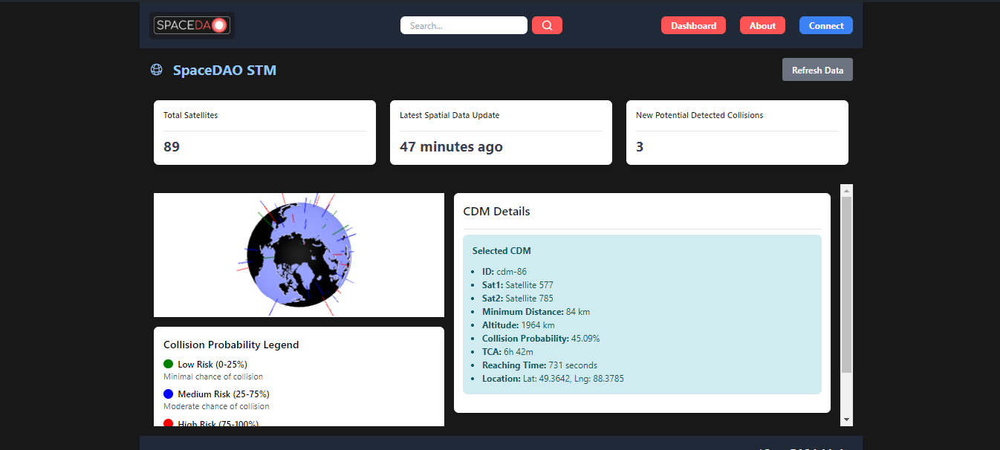

# Space traffic consensus smart contracts | Google Summer Of Code 2024


[Explore the docs »](https://gitlab.com/spacedao/web3/space-traffic-consensus)
· [View Demo](https://spacedao.ai/) · [Report Bug](https://gitlab.com/spacedao/web3/space-traffic-consensus/-/issues) · [Request Feature](https://gitlab.com/spacedao/web3/space-traffic-consensus/-/issues)

## Table of Contents

- [Overview](#-overview)
- [Smart Contracts](#-smart-contracts)
- [Architecture](#-architecture)
- [Technology Stack](#-technology-stack)
- [Key Features](#key-features)
- [Getting started](#-getting-started)
- [Testing](#-testing)
- [Deployment](#deployment)
- [Contributing](#-contributing)
- [Licensing](#-licensing)
- [Contact](#-contact)

## 🚀 Overview

SpaceDAO is a groundbreaking, community-driven initiative that revolutionizes space applications through decentralized collaboration and consensus. Our mission is to mitigate risks associated with centralized control of critical decision-making information in the space industry.
The Space Traffic Management (STM) dApp, powered by these smart contracts, enables:

- Cross-validation of Conjunction Data Messages (CDMs) by Space Situational Awareness (SSA) data providers
- Optimized spacecraft maneuvering based on consensus data
- Global orbital situation oversight for regulators and space lawyers



## 💼 Smart Contracts

1. `SpaceDAOID.sol`:

- Manages user permissions and identity
- Stores comprehensive user information
- Implements role-based access control

2. `Confidence.sol`:

- Handles confidence scoring for data providers
- Implements adaptive confidence adjustment algorithms
- Supports multiple confidence categories (LEO, MEO, HEO, GEO)

3. `ConsensusCDM.sol`:

- Manages the consensus process for CDMs
- Implements weighted voting based on provider confidence
- Handles data submission, validation, and fusion

## 🏗 Architecture

Our decentralized application follows a robust architecture:

```graph TD
   A[Frontend Vue.js App] -->|Interacts with| B[Web3 Provider]
    B -->|Sends transactions to| C[Arbitrum Network]
    C -->|Executes| D[SpaceDAOID Contract]
    C -->|Executes| E[Confidence Contract]
    C -->|Executes| F[ConsensusCDM Contract]
    D <-->|Interacts with| E
    E <-->|Interacts with| F
    F -->|Emits events| G[Event Listeners]
    G -->|Updates| A
```

## 🛠 Technology Stack

- Smart Contracts: Solidity ^0.8.20
- Development Environment: Hardhat
- Blockchain: Arbitrum
- Frontend: Vue.js 3 with TypeScript
- Styling: TailwindCSS
- Testing: Mocha & Chai
- Continuous Integration: GitLab CI/CD

## Key Features

- 🌐 Decentralized identity and permission management positions and trajectories
- 🚨 Advanced confidence scoring system for data providers
- 🤝 Weighted consensus mechanism for Conjunction Data Messages
- 🔗 Scalable and low-fee operations on Arbitrum
- 🛠 Real-time event processing and updates
- 🧪 Comprehensive test suite ensuring contract reliability

## 🛠 Getting Started

Follow these steps to set up the project locally.

## Prerequisities

- Node.js (v14.x or later)
- npm (v6.0.0 or later)
- Hardhat

## Installation

1. Clone the repository

   ```sh
   git clone https://gitlab.com/spacedao/web3/space-traffic-consensus.git
   cd space-traffic-consensus
   ```

2. Install dependencies

   ```sh
   npm install
   ```

3. Set up environment variables

```sh
   cp .env.example .env
   # Edit .env with your specific configuration
```

## 🧪 Testing

Run the comprehensive test suite:

1. **Run the comprehensive test suite**:

```sh
npx hardhat test
```

2. **For coverage reports**:

```sh
npx hardhat coverage
```

## Deployment

Deploy to Arbitrum testnet:

```sh
npx hardhat run scripts/deploy.ts --network arbitrum_testnet
```

## 🤝 Contributing

We welcome contributions from the space and blockchain communities! Please read our Contributing Guidelines for more information on how to get involved.

Don't forget to give the project a star! Thanks again!

## 📜 Licensing

This work is licensed under the GNU LESSER GENERAL PUBLIC LICENSE
version 3 and above. All contributors accepts terms of this license.
See `LICENSE` for more information.

## 📞 Contact

- SpaceDAO Team - [@SpaceDAO](https://www.linkedin.com/company/space-dao-ai/)
- Project Link: https://gitlab.com/spacedao/web3/space-traffic-consensus

Built with ❤️ by the SpaceDAO community
